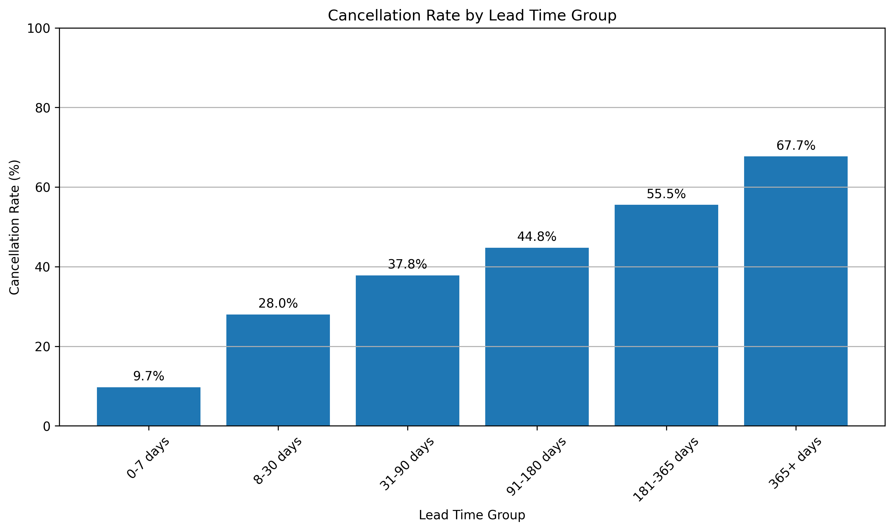
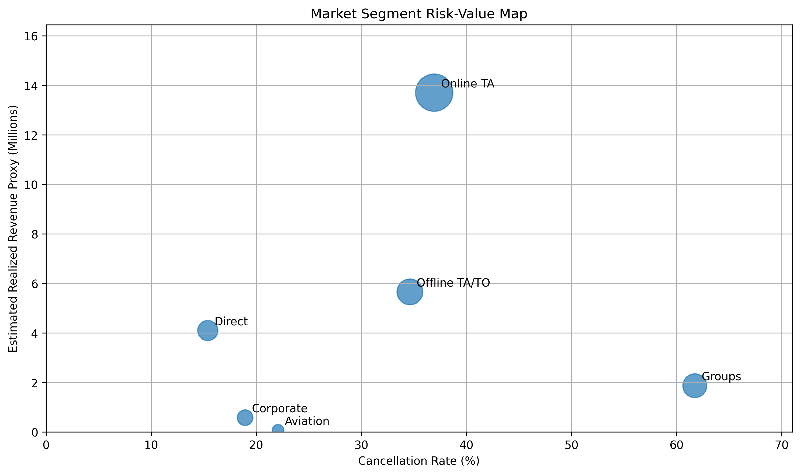
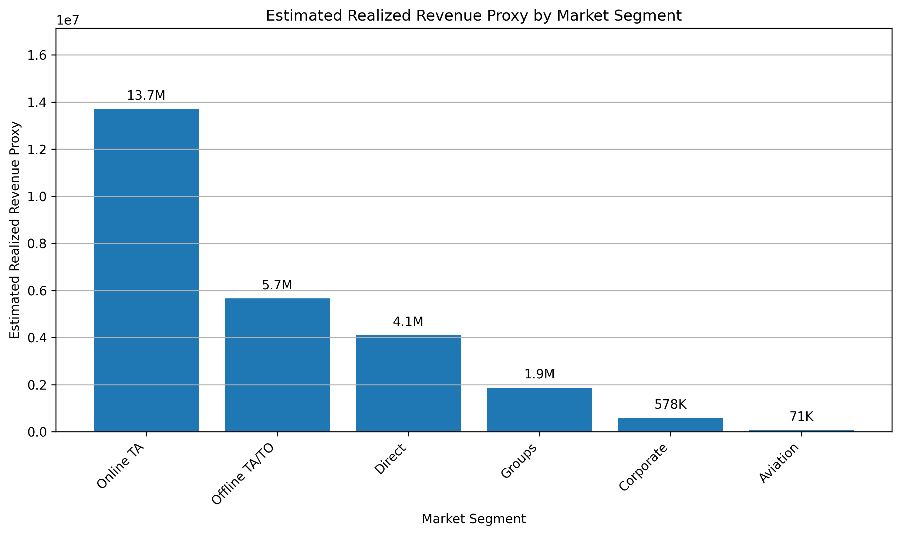
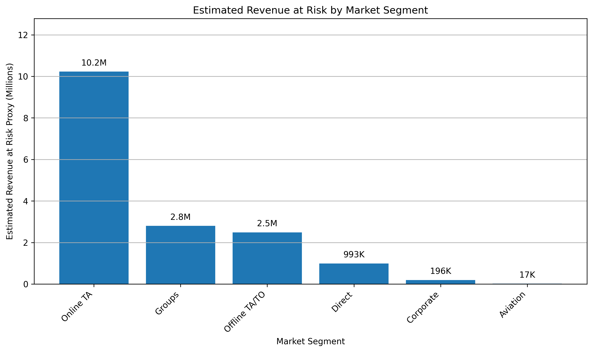
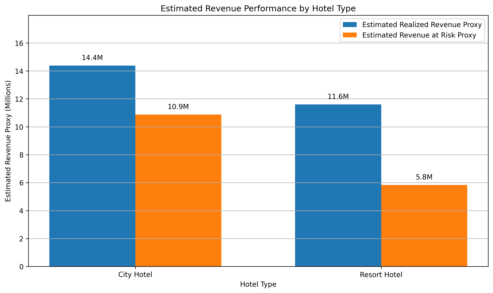

# Hotel Booking Demand Analysis: Revenue Drivers and Cancellation Risk

## Project Overview

This project analyzes hotel booking demand data to identify booking patterns, cancellation risk, ADR trends, and estimated revenue exposure across hotel types and market segments.

The goal of this project is to connect data analysis with practical hotel revenue management decisions, including cancellation risk management, channel strategy, and revenue protection.

This project was completed as a portfolio project using Python, pandas, NumPy, Matplotlib, Kaggle Notebook, and GitHub.

---

## Business Questions

This project focuses on the following business questions:

1. How do booking patterns differ between city hotels and resort hotels?
2. Which booking characteristics are associated with higher cancellation risk?
3. How does ADR vary by hotel type and market segment?
4. Which market segments contribute the most estimated realized revenue?
5. Which segments create the largest estimated revenue exposure from cancellations?
6. How can hotels use these insights to improve revenue management decisions?

---

## Dataset

The project uses the public **Hotel Booking Demand** dataset from Kaggle.

The dataset includes hotel booking records with information such as:

- hotel type
- cancellation status
- lead time
- arrival date
- length of stay
- number of guests
- market segment
- distribution channel
- customer type
- ADR

Because the dataset does not include actual total room revenue, this project uses a revenue proxy calculated as:

`Revenue Proxy = ADR × Total Nights`

This proxy is used to compare estimated revenue patterns across hotel types and market segments. It should not be interpreted as actual reported hotel revenue.

---

## Tools Used

- Python
- pandas
- NumPy
- Matplotlib
- Kaggle Notebook
- GitHub

---

## Project Workflow

The project followed this workflow:

1. Data loading
2. Initial data inspection
3. Data cleaning
4. Feature engineering
5. Exploratory data analysis
6. Key findings
7. Business recommendations
8. Limitations
9. Conclusion

During the cleaning and feature engineering process, the project handled missing values, removed invalid records, created total guest and total night variables, grouped lead time categories, created date-based variables, and built revenue-related proxy variables.

---

## Key Visualizations

### Cancellation Rate by Lead Time Group



This chart shows that cancellation rates increase as lead time becomes longer. Bookings made within 0–7 days had the lowest cancellation rate, while bookings made 365+ days in advance had the highest cancellation rate.

---

### Market Segment Risk-Value Map



This visualization compares cancellation risk and estimated realized revenue proxy by market segment. `Online TA` stands out as a high-value segment with meaningful cancellation risk, while `Direct` appears to be a more stable high-value segment.

---

### Estimated Realized Revenue Proxy by Market Segment



This chart shows that `Online TA` generated the highest estimated realized revenue proxy, mainly because of its large completed booking volume.

---

### Estimated Revenue at Risk by Market Segment



This chart shows that `Online TA` also created the largest estimated revenue at risk proxy, meaning it is both a major revenue source and a major cancellation-related exposure point.

---

### Estimated Revenue Performance by Hotel Type



This chart compares estimated realized revenue proxy and estimated revenue at risk proxy between city hotels and resort hotels. City hotels generated higher estimated realized revenue, but they also carried higher cancellation-related revenue exposure.

---

## Key Findings

### Finding 1: City hotels show stronger booking volume but also higher cancellation risk.

City hotels recorded higher booking volume than resort hotels across most months in the observed period. However, city hotels also showed higher cancellation rates and higher estimated revenue at risk. This suggests that stronger booking demand does not automatically translate into lower revenue risk.

### Finding 2: Longer lead time is associated with higher cancellation rates.

Cancellation rates increased consistently as lead time became longer. Bookings made within 0–7 days had the lowest cancellation rate at approximately 9.7%, while bookings made 365+ days in advance had the highest cancellation rate at approximately 67.7%. This suggests that lead time can be used as an early indicator of cancellation risk.

### Finding 3: Market segments differ significantly in both value and risk.

`Online TA` generated the highest estimated realized revenue proxy and also the highest estimated revenue at risk proxy. `Groups` had the highest cancellation rate among major market segments, while `Direct` showed a stronger balance of high ADR, meaningful revenue contribution, and lower cancellation risk.

### Finding 4: High ADR does not always mean the highest total revenue contribution.

`Direct` had the highest average ADR among major market segments, but `Online TA` generated the highest estimated realized revenue proxy because it had much higher completed booking volume. This shows that revenue contribution depends on both price and volume.

### Finding 5: Revenue management decisions should consider both cancellation risk and revenue value.

Segments with high booking volume or high ADR may still create substantial revenue exposure if cancellation rates are also high. A combined risk-value view is more useful than analyzing ADR, booking volume, or cancellation rate separately.

---

## Business Recommendations

### Recommendation 1: Use lead time as an early cancellation risk signal.

Hotels should monitor long lead-time reservations more carefully, especially bookings made more than 180 days in advance. Possible actions include reminder emails, stronger confirmation requirements, revised deposit policies, and cancellation-adjusted forecasting.

### Recommendation 2: Manage Online TA bookings as both high-value and high-risk.

`Online TA` contributes substantial estimated realized revenue, but it also creates the largest estimated revenue at risk. Hotels should manage this segment with stronger cancellation forecasting, targeted reminders, and channel-specific booking policies.

### Recommendation 3: Review group booking policies.

`Groups` showed the highest cancellation rate among major market segments. Hotels may benefit from clearer deposit requirements, earlier reconfirmation deadlines, staged cancellation penalties, and closer monitoring of large group blocks.

### Recommendation 4: Strengthen direct booking strategy.

`Direct` bookings showed high ADR and lower cancellation risk compared with several major third-party segments. Hotels could encourage direct bookings through loyalty benefits, direct-channel offers, and clearer cancellation terms.

### Recommendation 5: Use a risk-value approach.

Revenue management decisions should combine booking volume, ADR, cancellation rate, estimated realized revenue, and estimated revenue at risk instead of relying on one metric alone.

---

## Limitations

This project uses a public hotel booking demand dataset, so several limitations should be considered.

First, the dataset does not include actual reported total room revenue. Therefore, this project uses a revenue proxy calculated as ADR × total nights.

Second, the dataset does not provide full information about hotel capacity, room inventory, operating costs, or profit margins. As a result, the analysis focuses on booking demand, ADR, cancellation risk, and estimated room revenue proxy rather than full hotel profitability.

Third, the analysis is based on historical data from the observed period. Booking behavior, channel mix, cancellation policies, and market conditions may change over time.

Fourth, this project identifies associations between variables such as lead time, market segment, hotel type, and cancellation behavior. These relationships should not be interpreted as causal without additional statistical testing or experimental evidence.

Finally, some very small market segments were excluded from selected visualizations to avoid misleading interpretation.

---

## Full Notebook

The full analysis notebook is available in this repository:

`hotel-booking-demand-analysis.ipynb`

The project was originally completed in Kaggle Notebook and then organized in GitHub for portfolio presentation.

---

## Repository Structure

```text
hotel-booking-demand-revenue-analysis/
│
├── README.md
├── hotel-booking-demand-analysis.ipynb
├── cancellation_rate_by_lead_time_group.png
├── hotel_type_revenue_performance.png
├── market_segment_risk_value_map.png
├── realized_revenue_proxy_by_market_segment.png
└── revenue_at_risk_by_market_segment.png
```

---

## Portfolio Relevance

This project demonstrates applied data analysis skills in a hospitality revenue management context. It shows the ability to clean and transform booking-level data, create business-relevant metrics, visualize patterns, interpret results, and translate analysis into actionable recommendations.
